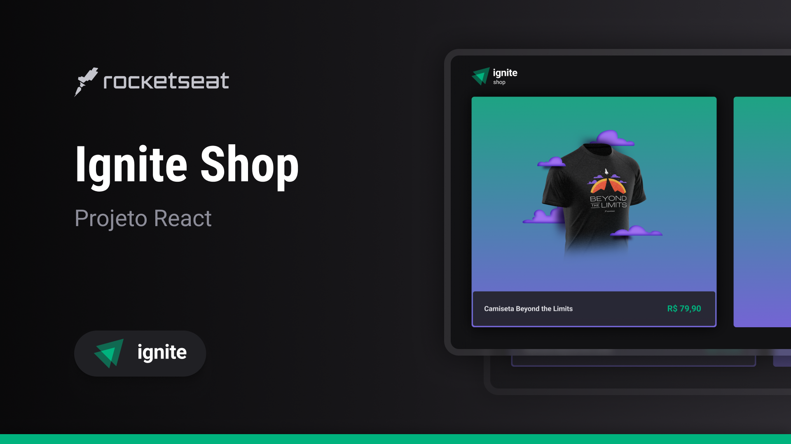

<h1 align="center"> Ignite Shop </h1>

<p align="center">
 Esta aplicação simula uma loja de produtos e utiliza o Stripe para gerenciamento produtos e pedidos, Stitches e Radix-UI para estilização, Axios para consumo dos dados implementados no servidor do Next, e outras bibliotecas auxiliares para melhorar a experiência do usuário. <br/>
</p>

<p align="center">
  <a href="#-tecnologias">Tecnologias</a>&nbsp;&nbsp;&nbsp;|&nbsp;&nbsp;&nbsp;
  <a href="#-funcionalidades">Funcionalidades</a>&nbsp;&nbsp;&nbsp;|&nbsp;&nbsp;&nbsp;
  <a href="#-layout">Layout</a>&nbsp;&nbsp;&nbsp;|&nbsp;&nbsp;&nbsp;
  <a href="#memo-licença">Licença</a>
</p>

<p align="center">
  
</p>

<br>

<p align="center">
  
</p>

## 🚀 Tecnologias

Esse projeto foi desenvolvido com as seguintes tecnologias:

- Typescript
- Next.js (Conceitos fundamentais do Next.js e Per-Page Layout)
- Stripe
- Stitches
- Axios
- Keen-slider
- Server-Side Renderig (SSR)
- Static Site Generation (SSG)

## 💻 Funcionalidades:

- [x] Carrossel de produtos na página principal
- [x] Página de detalhes do produto
- [x] Redirecionamento para a página de pagamento (Stripe)
- [x] Página de Sucesso

## 🔖 Layout

Você pode visualizar o layout do projeto através [DESSE LINK](https://www.figma.com/file/hfnMLivdBG9CADpq0F6vT3/Ignite-Shop-%E2%80%A2-Projeto-React-(Copy)?type=design&node-id=4175-92&t=BpPx5mXUpSFOUwXu-0). É necessário ter conta no [Figma](https://figma.com) para acessá-lo.

## 🚀 Instalação e uso

```bash
# Clone o repositório
git clone https://github.com/Alexandre-Schmidt/shop.git

# Acesse a pasta do projeto
cd shop

# Instale as dependências
npm install

# Execute a aplicação
npm run dev

# O servidor inciará na porta:3000 - acesse http://localhost:3000
```

## :memo: Licença

Esse projeto está sob a licença MIT.

---

:wave: Confira meu perfil profissional no [LinkedIn](https://www.linkedin.com/in/alexandreborgesschmidt/)
